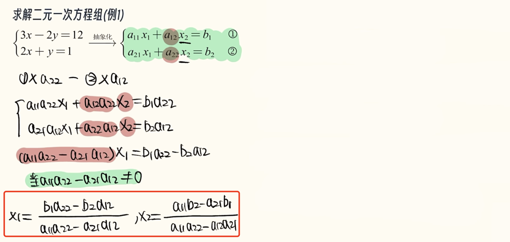

# 二三阶行列式

[TOC]

### 引入

**行列式出现的原因：**

对于**多元方程组**的直接求解较为困难，引入了行列式的形式进行**系数的表示**，直接使用行列式进行相关运算使得这一类的方程组求解非常简单。

### 行列式的本质

行列式的本质是个**数**

> 可以粗略定义为“**行数等于列数**，边界有两条竖线的**算式**”

### 行列式的来源

#### 二元一次方程组

以求解二元一次方程组为例，抽象化后直接运算（消元）导致结果较为复杂

观察到保证方程组有唯一解的 $a_{11}a_{22}-a_{21}a_{12}$ 同时出现在 $x_1 , x_2$ 的分母中，由方程组的未知数系数构成。

进一步发现是由未知数系数对角线相乘后相减得到，因此引出**二阶行列式**的定义：

可以通过二阶行列式 $D$ 判断二元一次方程组是否具有**唯一解**。（行列式值=0则不具有唯一解）

行列式（**deter**minant），也被称为“决定式”，决定了这类方程组是否有唯一解。

- 行列式为0：**无穷多解** 或 **无解**
- 行列式不为0：**唯一解**

继续观察 $x1,x2$ 的分子：

- $b_1a_{22}-b_2a_{12}$ 相当于 $D$ 第一列被等式右侧常数替换 $=D_1$​​ 
  $$
  b_1a_{22}-b_2a_{12}=
  \left | \begin{matrix}
  b_1 &a_{12} \\
  b_2 &a_{22} 
  \end{matrix} \right | 
  =D_1
  $$

- $a_{11}b_2-a_{21}b_1$ 相当于 $D$ 第二列被等式右侧常数替换 $=D_2$​​
  $$
  a_{11}b_2-a_{21}b_2=
  \left | \begin{matrix}
  a_{11} &b_1 \\
  a_{21} &b_2 
  \end{matrix} \right | 
  =D_2
  $$

因此 $x_1=\frac{D_1}{D},x_2=\frac{D_2}{D}$​

> 例：求解二元一次方程组
>
> 

#### 三元一次方程组

同理，三元一次方程组唯一解的判定：

三阶行列式的求解：**对角线法则**

本质上是**三条主对角线乘积的和 减去 三条次（副）对角线乘积的和**

主对角线的判定：行列式拼接

> 例：
>
> 计算三阶行列式
>
> 
>
> 求解方程
>
> 

